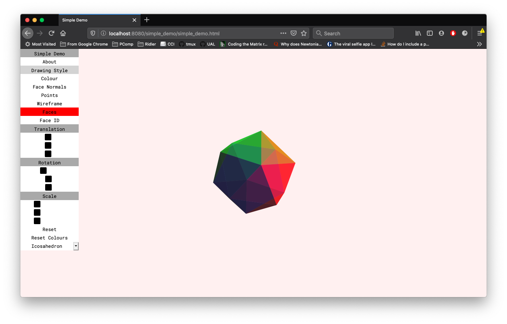
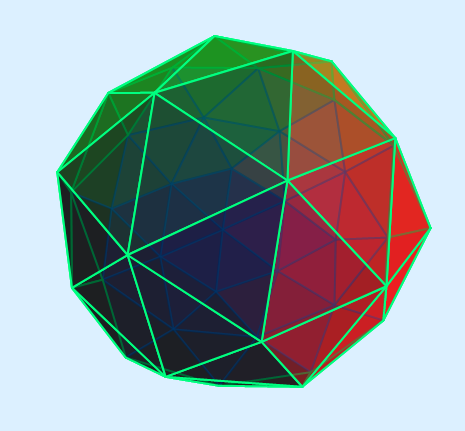

# 3D Engine Simple Demo

---

## [The project is currently online here.](https://serene-agnesi-09afd7.netlify.app/simple_demo/simple_demo.html)

---



The purpose of this demo is to show off some of the basic functionality of the 3D engine. It has the basic rendering styles in the menu and a selection of platonic and parametric solids to render.

I've spoken about most of the core aspects of the engine [here](../) so I'll just mention some other details here.

### Icosphere



I was quite pleased with my implementation of an Icosphere so I'll give it a mention. It was based on [this](http://blog.andreaskahler.com/2009/06/creating-icosphere-mesh-in-code.html) implementation originally in C#. An Icosphere is derived from an Icosahedron so you need one of those to start. It is then generated by creating new vertices at the midpoints of all the edges and then creating new faces from these vertices.

```
      *                    *
                              
                ->       *   *
                               
  *       *            *   *   *
```

Icosahedron vertices can be normalised so as to lie on the unit sphere, so the same can be done with the newly created vertices.

As you are repeating this process for every face, the tricky part is keeping track of the vertices you are creating and trying not to create duplicates. [Andreas Kahler](http://blog.andreaskahler.com/2009/06/creating-icosphere-mesh-in-code.html) creates a map of each new midpoint vertex, which uses the points of the vertex itself stored as a `Int64` as an ID. I do a similar thing, but JavaScript doesn't allow for such simple bit shifting operations in data types. So I created a simplified version which takes the first five digits of each coordinate in the vertex and concatenates them into a 15 digit key. If the key is unique then the vertex is given an incremented ID.

```javascript
addToVertIndex(v){
    // Create key unique to given vertex
    let k = String(v.x).substring(0,5)+String(v.y).substring(0,5)+String(v.z).substring(0,5);
    // if key already exists, return
    if(this._vertIndex[k]) return;
    // else add to the dictionary with and incremented ID number, and the vertex position
    else this._vertIndex[k] = [this._vertIdCounter++, v];
}
```

This means I can create vertices and faces simultaneously which is much easier to keep track of which vert belongs to which face. And duplicates do not matter as `getId()` returns the correct ID of a vertex if it already exists.

This process can then be iterated if a more refined Icosphere is needed. But 3 iterations seems to be limit before it crashes...

## TODO:

- Clipping/Culling.
- Mouse picking to highlight faces or edges.
- Mouse manipulation (rotation, zooming).
- Animation (rotation, orbit, multiple meshes perhaps).
- Figure out why it warps so much when the mesh is moved near the edge of the screen.
