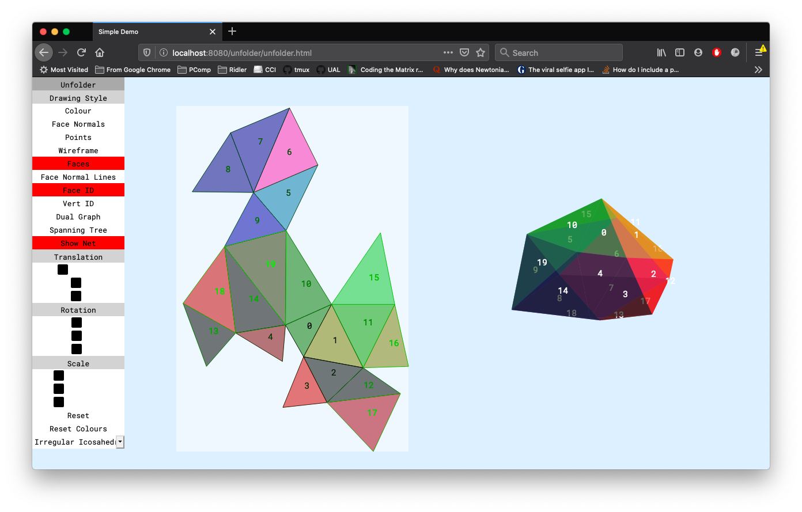
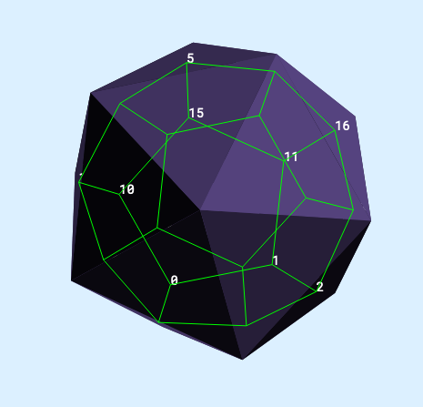
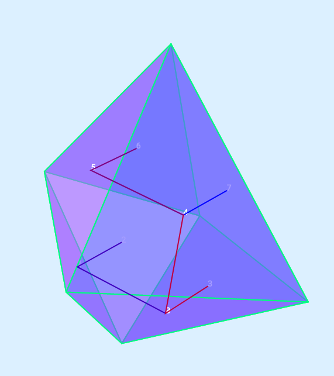
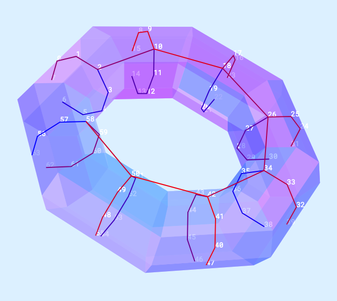
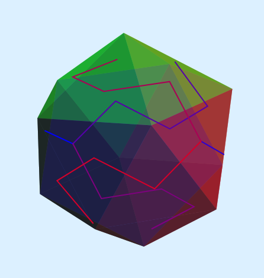
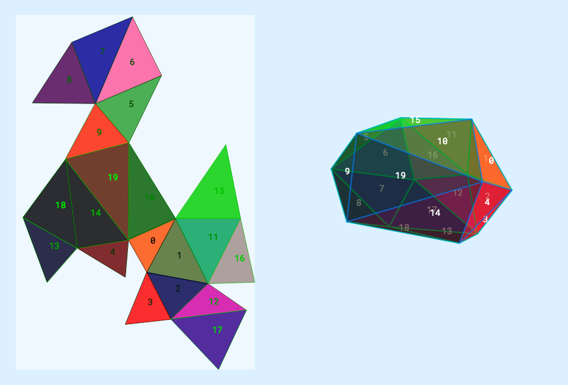
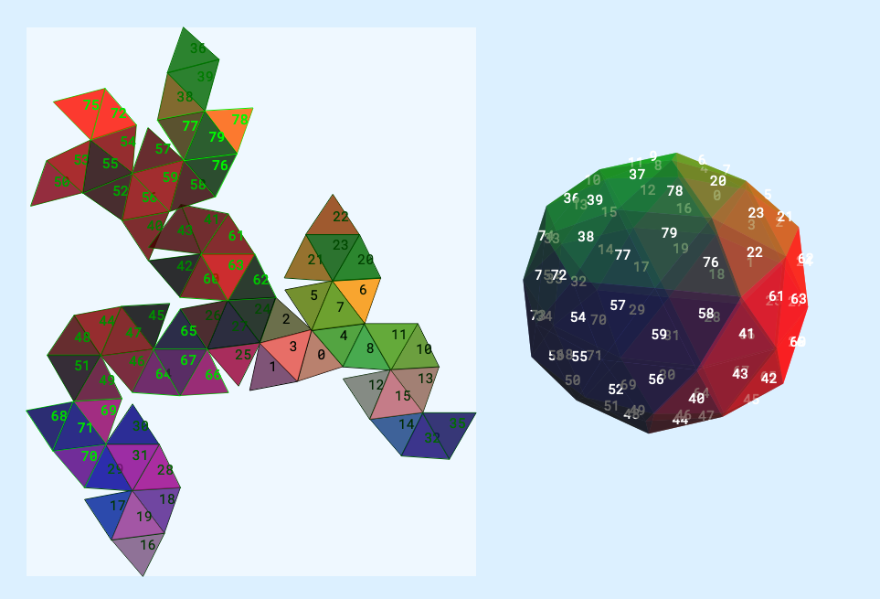

# 3D Geometry Unfolder



The initial reason for creating this 3D engine was to build this unfolding tool. I never thought it was going to be _easy_, and it wasn't. I'll run through the way I went about this problem, the difficulties I encountered along the way and why it still is not performing particularly well. This is however an Easter project and needs to end soon, so consider this a checkpoint.. I would say I acheived my minimum-viable-product :man_shrugging: but there is __a lot__ of room for improvement.

## Unfolding

### Dual Graph

The first step in producing a net for a given 3D geometry is creating a __dual graph__. A dual graph is a fancy name for creating pairs of adjacent faces. This can be created quite easily by comparing each face with every other, and if the two have at least 2 shared vertices, then they are adjacent.

The dual graph can also be represented by the polyhedra which has a vertex at the centroid of each face of the original polyhedra:



### Spanning Tree

Next we turn the dual graph into a __spanning tree__. The purpose of the spanning tree is condense the dual graph into strings of faces whereby each face is only a child of _one other_ face. So a face can have multiple children (n_sides-1) but only one parent. [This article](https://algorithms.tutorialhorizon.com/graph-find-cycle-in-undirected-graph-using-disjoint-set-union-find/) explains what is happening quite well (in graph theory terms). The spanning tree should include all faces only once.

First you sort the dual graph based on a given weighting. I experimented with a few different ways of sorting, but I found the most successful to be based on the angle between the pair of faces. This can be found quite easily using the dot product of the two face normals.

Next I sort each pair in the dual graph by its area, putting the largest first. This is to put a secondary weighting on the larger face sizes (a tip I picked up [here](https://houdinigubbins.wordpress.com/2017/05/12/unfolding-geometry/)).

Then I found I had to re-iterate over the dual graph once to more to make sure there is at least one occurance of each face as a parent and a child. If it is a large face then it will always be a parent. So reversing back through the dual graph I swap each pair where this makes sense to do so.

Next, starting from the top, we check if the child of each pair is already a child; if it is not we add it to the tree.

To combine pairs into branches, `completeSpanningTree` recursively checks each parent to see if it is a child elsewhere in the tree and replaces that child with the current parent-child pair. Hard to put in words but:

```
Parent  Parent    Parent  
 | Child | Child   | Child
 |  |    |  |      |  | Child
 |  |    |  |      |  |  |
[A, B], [B, C] -> [A, B, C]
```

As an extra step the tree is then sorted by length of branch - longest first.

The spanning tree when drawn makes a lot more sense:





Despite the _visual_ spanning tree looking good, the numerical representation reveals that it is not always great. Particularly in shapes which have all faces of the same size and shape (platonic solids). The icosahedron became my test case in this instance which has a spanning tree like so:

```
------------------
[0, 4, 14]
[1, 0, 10, 19]
[2, 1, 11, 15]
[2, 3, 13, 18]
------------------
[6, 7, 17]
[9, 5,  6, 16, 12]
[9, 8]
------------------
```

The tree is made of two completely seperate trees, which can just about be seen here:



I could either tackle the problem here, in the creation of the spanning tree, but for better or worse I decided to attempt to solve it when laying out the net.

## The Net

This was the final __headache__ of the whole project, or at least the most recent. There are _many_ ways of approaching this problem. You could literally attempt to unfold the mesh face-by-face (I tried that), or flatten each face onto the XZ plane using rotations and translations (I tried that too), OR you could use some nifty maths to project each face on to a virtual plane and convert 3D coordinates to 2D x and y coordinates (I did that one). `create2dCoordsFromFaces()` does just that.

At this point there is a spanning tree which describes how the net should be contructed, and there is an array of each face in terms of x and y coordinates. `layoutNet()` is a pretty large funciton which iterates through the spanning tree by branch and attempts to place each face, starting from the root of the branch (what should be the biggest face) and place each successive face by rotating it to line up the joining vertices with the previous face.

The transformation is formed by taking an _anchor_, which is the point around which to rotate the current face, and an _origin_, which is the corresponding point on the previous face. So the anchor and origin are the _same vertex_ but on different faces. Thus the faces should line up if the rotation is correct. The angle is found by taking the angle of the joining edge on the previous vertex and subtracting that of the angle from the same edge of the current.

> NB: At this point I had to do some slightly hacky checks to see if the face needed to be spun 180 degrees as `atan2` only returns a value between 0 and &pi;, so if the face _did_ need to be spun 180, then the angle would be 0.. So I used floating point __imprecision__ to my advantage here to see if the angles were slightly _off_ PI and if so, I'd take that to mean 180:

```
if(((angle1 < -1.57 && angle1 > -1.58) && (angle2 > 1.57 && angle2 < 1.58))    ||
   ((angle2 < -1.57 && angle2 > -1.58) && (angle1 > 1.57 && angle1 < 1.58))    ||
   ((angle1 > 3.141 && angle1 < 3.142) && (angle2 > -0.001 && angle2 < 0.001)) ||
   ((angle2 > 3.141 && angle2 < 3.142) && (angle1 > -0.001 && angle1 < 0.001)){
        oneeighty = true;
}
```

The first branch is easy enough as you set the first face with no transformation applied, and then the next face based on that one. With later branches we check if the root of the branch can be connected with faces on prior branches, and this __has__ to be the case. The first face placed needs to become the root of the entire net. Alternatively we could begin a _new_ net and the two should join, but I could see no reason why it wouldn't work, particularly with simpler convex shapes.

So to solve this, if a branch could not be joined with the already joined net, it is put to the bottom of the pile and then the next if attempted. If it gets through the entire tree and none can be added, then the branch is reversed. As is often the case, the ends of the branches in the spanning tree are adjacent to the first face in the branch (the face after going all the way round the 3D shape). This seemed solve some problems and the resulting nets were formed:





You can see the lower icosphere net is not perfect as it has some overlapping faces. But I saw this as something of a success...

Finally the colours can be taken from the model itself and colour the faces as per the model.

## TODO:

I did not manage to get this project to the point I had hoped, largely because I decided to build the rendering aspect from scratch also, so spent a lot of time implementing 4x4 Matrix classes and learning about projection matrices etc. However I think it did serve me well when it came to implementing the unfolding algorithm as I had a pretty thorough understanding of the whole system! However, still on the list is:

- Refine the Spanning Tree to better accomodate concave shapes, or shapes with holes.
- Add tabs to the net.
- Export the net as an SVG for printing or laser cutting.
- Label the net with inside/outside folds. 
- Edge-to-edge labelling (A -> A).
- User defined cuts.
